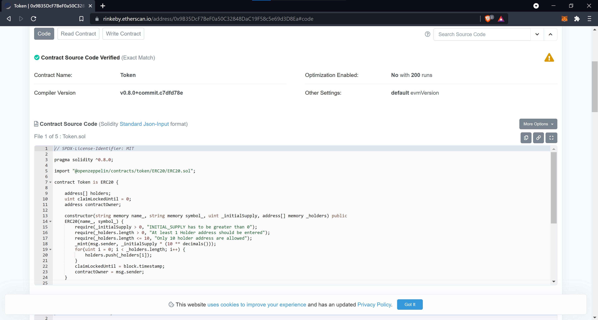
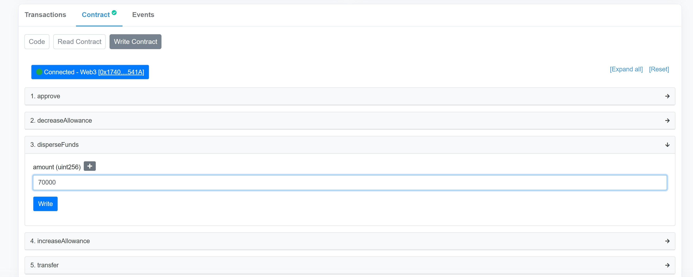
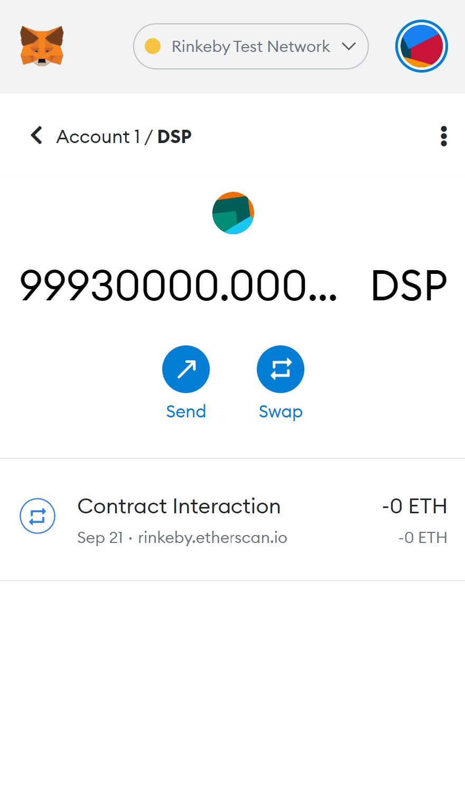
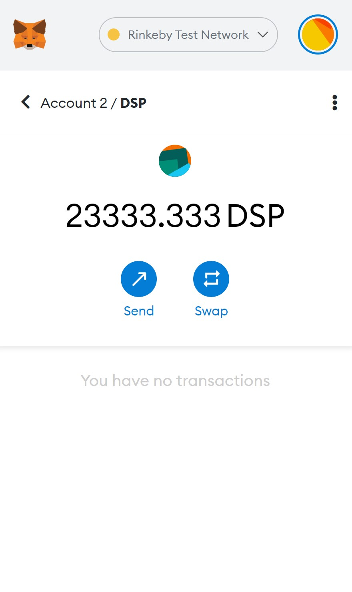

# DSP Token

DSP token is an ERC20 based standard fungible Token which is deployed to the Ethereum's Rinkeby test network with a total supply of 100,000,000 tokens

## About the Token

This Token's smart contract is written in solidity with the help of OpenZeppelin library and Truffle is used to compile and deploy to the Ethereum's public test network called Rinkeby.

The contract deployer(contract owner) can enter upto 10 addresses to disperse funds whenever required. Dispersing of funds can happen only once in 1 minute. When the disperse function is called, the funds are dispersed to all these accounts equally.

## What is the contract address of this token?

The contract address of this token is 0x9B35DcF7BeF0a50C32848DaC19F58c5e69d3D8Ea

## How to view more details about the token?

<a href="https://rinkeby.etherscan.io/token/0x9B35DcF7BeF0a50C32848DaC19F58c5e69d3D8Ea">Click here</a> to view the details of the token.

The Token's contract is also verified on Etherscan using `truffle-plugin-verify` inside truffle through Etherscan's API.
The code of the contract can be viewed on Etherscan along with interaction such as read or write.

## Libraries/services used

- **@openzeppelin/contracts** - For inheriting the ERC20 token standard into this token
- **truffle** - Framework to make compiling, deploying and testing the smart contract easier
- **solc** - For writing smart contracts in solidity and compiling it
- **mocha & chai** - For writing tests on smart contracts
- **Infura** - To get the API endpoint to interact with the Ethereum public network
- **@truffle/hdwallet-provider** - To import the wallet's details using seed phrase and infura api key which is used to deploy the smart contract
- **truffle-plugin-verify** - To verify the contract on Etherscan using its API

## Screenshots

- Verified on Etherscan

- Dispersing 70,000 tokens to all the 3 accounts entered by the contract deployer while deploying

- Remaining tokens after dispersing 70,000 out of 100,000,000 tokens

- Tokens in one of the dispersed accounts => 70,000 / 3 = 23,333.333

## Developer

- **Dinesh B S** [(@DineshBS44)](https://github.com/DineshBS44)

## License

Licensed under MIT License : https://opensource.org/licenses/MIT

 
 
